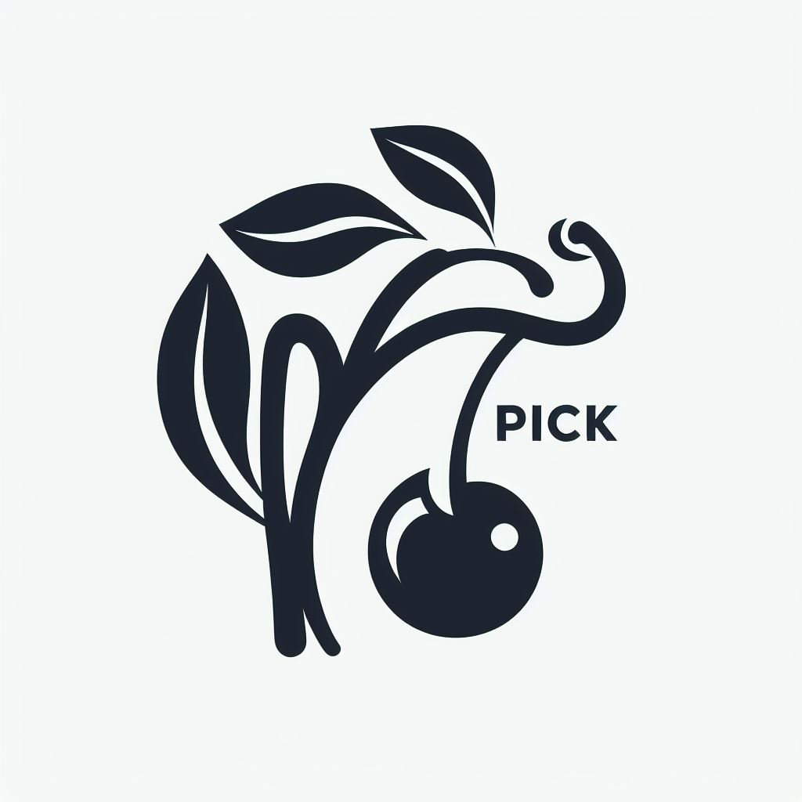

# flickr-images-cherry-picker

🍒🍒🍒 Flickrの画像をチェリーピックするためのツールです！  

  
※ このロゴは[Bing Image Creator](https://www.bing.com)によって作成されました。  

  

  

## 実行方法

はじめに、FlcikrのAPIキーを取得してください。  
[The App Garden](https://www.flickr.com/services/api/)の`API Keys`から新規作成できます。  

次に、`.env.local.example`を`.env.local`にリネームし、APIキーを設定してください。  

以下のコマンドで、ローカルで実行できます。  

```shell
# モジュールのインストール
yarn install

# ローカルで実行
yarn dev

# ビルド
yarn build
```

Dockerを使って実行することもできます。  

```shell
# ビルド
docker build -t flickr-images-cherry-picker .

# 実行
docker run --rm -d -p 80:80 --name flickr-images-cherry-picker flickr-images-cherry-picker
```

## デプロイ方法

GitHub Actionsを使って、GitHub Pagesにデプロイしています。  
`v-*`という形式のタグを打つと、自動的にデプロイされます。  
また、手動でデプロイすることもできます。  

デプロイには、`ENV_LOCAL`という名前で、`.env.local`の内容をGitHub Secretsに設定する必要があります。  

詳細は`.github/workflows/cd.yml`を参照してください。  
